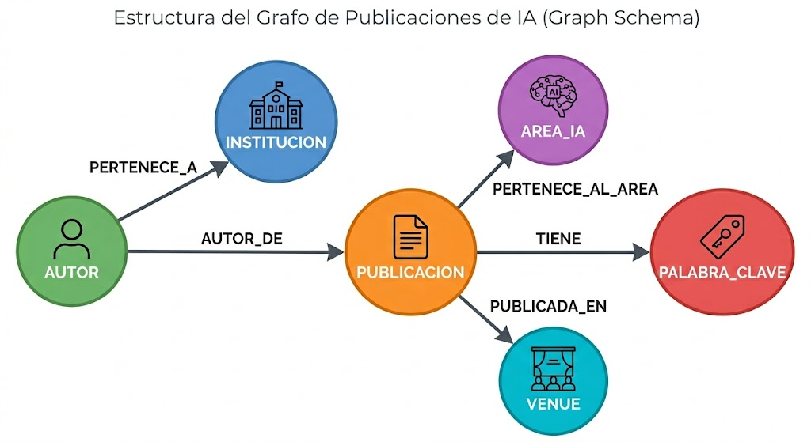

This is a [Next.js](https://nextjs.org) project bootstrapped with [`create-next-app`](https://nextjs.org/docs/app/api-reference/cli/create-next-app).

# Prueba Técnica CIAR

Este repositorio contiene la solución completa para la construcción de un **Agente de IA (GraphRAG)** capaz de interactuar en lenguaje natural con una base de datos orientada a grafos en **Neo4j AuraDB Free**. La aplicación está construida sobre **Next.js**, persistiendo las sesiones de manera local mediante **SQLite** y consumiendo de forma híbrida modelos avanzados de razonamiento a través de la API de **Google Gemini**.

---

## 🛠️ Instrucciones de Setup (Desde Cero)

Sigue estos pasos para configurar, inicializar y ejecutar de forma idónea el proyecto en tu entorno local:

### 1. Clonar el Proyecto
Abre una terminal y ejecuta los comandos para descargar el repositorio y ubicarte en su directorio raíz:
```bash
git clone [https://github.com/Nivek1702/AgenteAI.git](https://github.com/Nivek1702/AgenteAI.git)
cd AgenteAI

```

### 2. Instalar Dependencias

Instala los paquetes de Node.js requeridos por la arquitectura del sistema (incluyendo Next.js, LangChain, el driver de conexión de Neo4j y Better-SQLite3):

```bash
npm install

```

### 3. Configurar Variables de Entorno

Crea un archivo local con el nombre `.env.local` en la raíz de tu proyecto apoyándote en la plantilla base:

```bash
cp .env.example .env.local

```

Abre `.env.local` e introduce tus credenciales de infraestructura:

```env
NEO4J_URI=neo4j+s://xxxxxx.databases.neo4j.io
NEO4J_USERNAME=neo4j
NEO4J_PASSWORD=tu_contraseña_de_auradb
GOOGLE_API_KEY=AIzaSyTuApiKeyDeGemini
SQLITE_DB_PATH=chats.db

```

### 4. Ejecutar la Aplicación en Desarrollo

Levanta el servidor local de Next.js:

```bash
npm run dev

```

Navega a [http://localhost:3000](https://www.google.com/search?q=http://localhost:3000) en tu navegador para interactuar con la interfaz del Agente.

---

## Modelo de Grafo Propuesto y Justificación

El modelo conceptual del grafo se estructuró abstrayendo de manera atómica las entidades del negocio provistas en el archivo denormalizado `publicaciones_ia.csv`:



### Justificación del Diseño Orientado a Grafos

* **Fidelidad en Coautorías y Afiliaciones:** Al analizar el CSV original, se determinó que en publicaciones multi-autor (mismo `id_publicacion`), cada investigador registra de manera independiente su respectiva universidad de procedencia. Vincular `Institucion` directamente al nodo `Autor` evita la pérdida de granularidad de los datos y representa con precisión la realidad de las afiliaciones científicas.
* **Ventaja de Adyacencia Libre de Índices (Graph Traversals):** Transformar campos categóricos descriptivos como `area_ia`, `venue` o `palabra_clave` en nodos independientes permite resolver de manera inmediata consultas transversales complejas de negocio y eliminando operaciones de escaneo masivo de texto plano o costosos *JOINs* tradicionales.
* **Uso de Propiedades de Relación:** El atributo `orden_autor` se acopló directamente dentro de la arista `:AUTOR_DE`, dado que la jerarquía de autoría es un dato transaccional único por cada paper e investigador.


## Decisiones de Diseño y Puntos Extra Implementados

### 1. Guardrails de Seguridad (Extra 1)

Se incorporó un cortafuegos algorítmico de doble capa directamente en el servidor para mitigar conductas anómalas sin delegar la responsabilidad únicamente al prompt del LLM:

* **Intercepción de Entradas Maliciosas:** El backend evalúa la entrada del usuario mediante expresiones regulares configuradas para neutralizar ataques de *Prompt Injection*, intentos de evasión del sistema (*jailbreaks*) o comandos de supresión de directivas. De dar positivo, el flujo se detiene retornando un mensaje genérico controlado.
* **Bloqueo Explícito de Escritura Cypher:** Se analiza dinámicamente la sintaxis del query generado por la IA frente a una lista negra estricta de comandos de alteración de estado (`CREATE`, `MERGE`, `DELETE`, `DETACH DELETE`, `SET`, `REMOVE`, `DROP`, `LOAD CSV` y procedimientos `CALL` de escritura). Si se vulnera la lectura pura, la petición se aborta inmediatamente protegiendo el almacenamiento físico.

### 2. Ventana de Contexto del LLM via Sliding Window (Extra 2)

* **Estrategia Utilizada:** Ventana Deslizante (*Sliding Window*) parametrizada en base de datos.
* **Justificación:** Para mantener la memoria de la sesión de manera coherente, el servidor ejecuta una consulta síncrona a SQLite recuperando de forma exclusiva las **últimas 8 interacciones** cronológicas del chat actual. Esto permite al Agente resolver pronombres y referencias cruzadas (como comprender textualmente a qué se refiere el usuario con *"de esas"*) manteniendo el tamaño del prompt optimizado, protegiendo las cuotas de la API y garantizando una latencia plana. Ademas, no requiere de usar una llamada extra al llm para resumir y con esto habria mayor latencia y mayor costo por el uso del token (caso summary memory). Tambien, hacer truncado provoca cortar la sintaxis del prompt y confundir al llm entonces se arriesga la integridad.

### 3. Flujo del Agente Mejorado con Auto-corrección (Extra 3)

* **Estrategia Utilizada:** Ciclo de Retroalimentación y Auto-reparación Explícita en Caliente.
* **Justificación:** Si la consulta Cypher arrojada inicialmente por el LLM genera un error sintáctico o semántico en el motor nativo de Neo4j AuraDB (por ejemplo, aludiendo a una propiedad inexistente), un bloque de infraestructura `try/catch` intercepta el mensaje de error del sistema. En lugar de romper la experiencia de usuario con un código de error `500`, el servidor empaqueta el error nativo, formula un prompt de corrección técnica y le otorga de forma resiliente un **segundo intento** de reparación inmediata al modelo antes de sintetizar la respuesta final.

### 4. Automatización Agnóstica del Esquema (Mejora al Flujo Propuesta)

* **Mecanismo:** Introspección dinámica del catálogo de datos mediante procedimientos internos.
* **Justificación:** Para erradicar por completo las malas prácticas de codificación rígida (*hardcoding*) en los archivos del backend, la función `getGraphSchema` interroga en tiempo real a Neo4j mediante los comandos del motor `db.schema.nodeTypeProperties()`, `db.relationshipTypes()` y `db.schema.relTypeProperties()`. Esto garantiza inmunidad total frente a errores de mayúsculas/minúsculas (*case-sensitivity*) o discrepancias de tipado (como `Long` vs `Integer`), permitiendo que el Agente adapte de forma autónoma su contexto ante cualquier cambio estructural en el grafo sin requerir mantenimiento manual.

---

## Qué quedó fuera y/o mejoras y por qué

* **Aislamiento Cronológico en Nodos Temporales:** El año se preservó estrictamente como un atributo entero indexado dentro de la entidad `Publicacion` en lugar de segregar una entidad externa llamada `Año`.
* **Taxonomías Jerárquicas de Áreas de IA:** No se estructuraron subniveles de dependencia conceptual entre las disciplinas de inteligencia artificial (por ejemplo, indicar que *NLP* pertenece a *Deep Learning*). Mapear dependencias taxonómicas excedía los objetivos informativos del archivo origen denormalizado y habría inducido redundancia computacional.
* **Nombre de la conversion segun la tematica del primer chat:** Para el historial de las conversacion, no se muestra un titulo que represente la conversion o el primer comentario sobre la tematica, sino se muestra el contenido del primer chat. Este seria una mejor opcion para evitar mostrar una sentencia muy grande al usuario.
